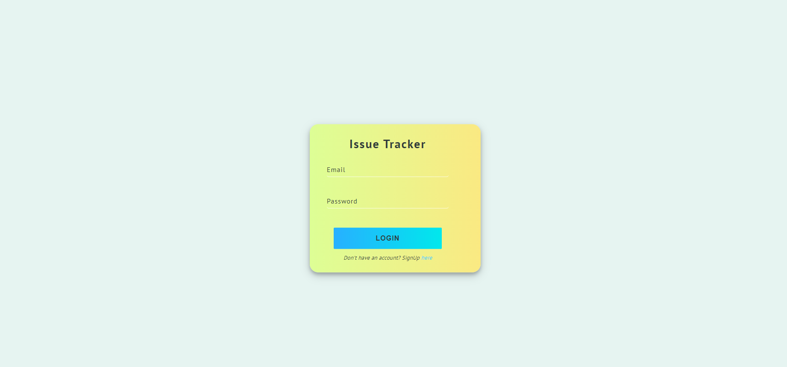
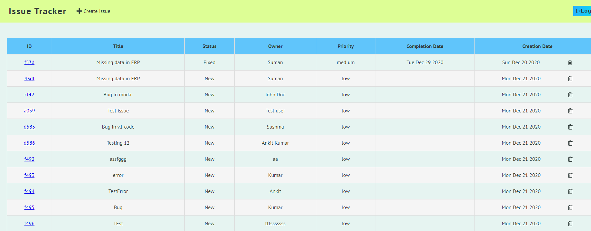
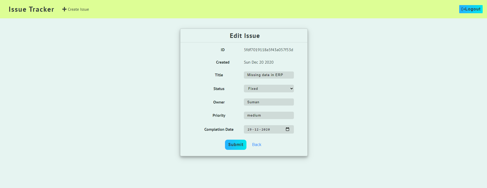

# Issue-Tracker

This is a basic issue-tracker app developed in MERN stack with below features-
* User Authentication and authorization
* Adding, Editing and Deleting an issue 

View Live Demo application [app](https://issue-tracker-ap.herokuapp.com)

  

